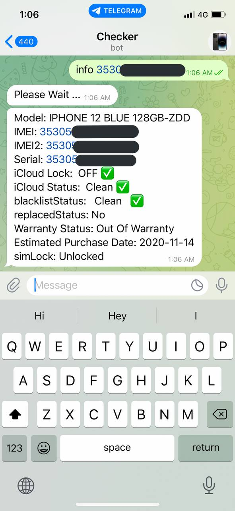

# Apple Devices checker

## Project Description

Apple Devices Checker that provides all details about any Model. 

Results will contain the following:
1. Model
2. IMEI / Serial
3. iCloud Lock 
4. iCloud Status
5. Blacklist Status
6. Replaced Status
7. Warranty Status
8. Estimated Purchase Date
9. SimLock

## How to Install and Run the Project

1. Git Clone the Repo
2. Add .env file with the following Keys : TOKEN(Your Telegram Bot Token), ID(Your Telegram ID), KEY(ifreeicloudUK API KEY), PORT.
3. Hit node start and enjoy :)

## ScreenShot

